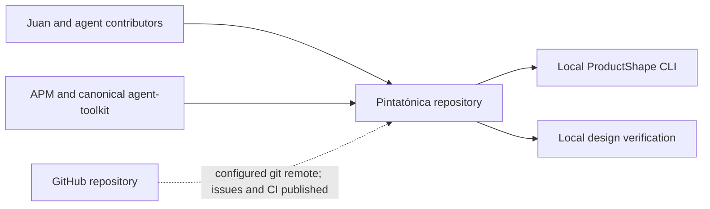

# Context and Scope

## Business Context

The deployed static public shell and Google/member-gated private application use Firebase Auth and Firestore. Accepted audiences and external material belong to [ACT-VISITOR](../product/model/actors/act-visitor.md), [ACT-MEMBER](../product/model/actors/act-member.md) and [UC-REPERTOIRE](../product/model/use-cases/uc-repertoire.md). Private repertoire uses external HTTP/HTTPS resource links; provider access permissions remain outside the application. Deliberately selected public song projections form a separate anonymous read boundary; its mechanism belongs to [section 08](08-crosscutting-concepts.md).

The [scheduling prototype evidence](../product/changes/completed/chg-initial/evidence/calendar.md) is an input to definition. Its runtime and access mechanism are not this repository's architecture.

## Technical Context

The following diagram covers the local repository and its tooling. Firebase runtime boundaries are documented in [06](06-runtime-view.md) and [07](07-deployment-view.md).

This is a tooling context, not an application deployment diagram. Installed dependency resolution is captured in [apm.yml](../../apm.yml), [apm.lock.yaml](../../apm.lock.yaml) and [pnpm-lock.yaml](../../pnpm-lock.yaml). Project-owned role skills address the GitHub repository through the adopted lifecycle; they do not demonstrate a published workflow.

## Input and Output Channel Mapping

| Partner | Current exchange | Evidence / unknown |
| --- | --- | --- |
| Contributors | Product proposals, architecture/design documentation and local verification | [AGENTS.md](../../AGENTS.md); [lifecycle](../engineering-lifecycle.md) |
| ProductShape | Markdown/configuration input and diagnostics/generated outputs | [.product/config.yaml](../../.product/config.yaml); [tooling](../tooling.md) |
| Agent Toolkit / APM | Skill distribution and locked source provenance | [apm.yml](../../apm.yml) |
| GitHub | Issues/PRs, verification and ProductShape snapshots | [Delivery](../delivery/README.md); existing workflows |
| Firebase Auth / Firestore | Google identity, protected private records and safe public projections | [Client](../../src/firebase/client.ts); [rules](../../src/firebase/firestore.rules) |
| Google identity | Enabled real sign-in; manually provisioned membership remains separate | [GH-2 evidence](../delivery/evidence/GH-2/README.md); [member operations](../operations/member-access.md) |
| Docs/Drive, YouTube / repository files | External resource links; no hosting, copying or permission bypass | [Repertoire link validation](../../src/band/repertoire.ts) |
