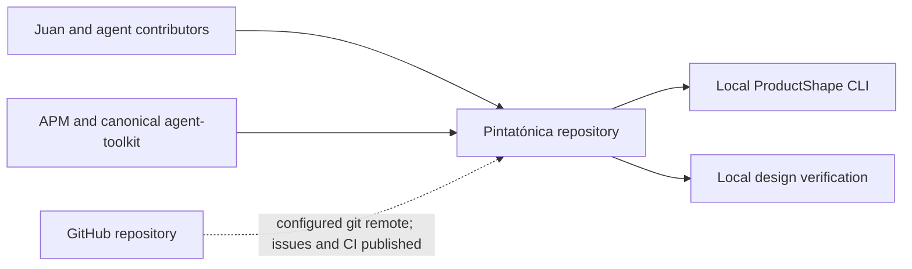

# Context and Scope

## Business Context

The full application boundary has not been designed. The accepted product's audiences and external material are described by [CHG-INITIAL](../product/changes/completed/chg-initial/change.md), with [ACT-VISITOR](../product/model/actors/act-visitor.md), [ACT-MEMBER](../product/model/actors/act-member.md) and [UC-REPERTOIRE](../product/model/use-cases/uc-repertoire.md). Firebase client and access-rule scaffolding exists; user-facing integrations are not yet evidenced.

The [scheduling prototype evidence](../product/changes/completed/chg-initial/evidence/calendar.md) is an input to definition. Its runtime and access mechanism are not this repository's architecture.

## Technical Context

The following diagram covers the local repository and its tooling. Firebase runtime boundaries are documented in [06](06-runtime-view.md) and [07](07-deployment-view.md).

This is a tooling context, not an application deployment diagram. Installed dependency resolution is captured in [apm.yml](../../apm.yml), [apm.lock.yaml](../../apm.lock.yaml) and [pnpm-lock.yaml](../../pnpm-lock.yaml). Project-owned role skills address the GitHub repository through the adopted lifecycle; they do not demonstrate a published workflow.

## Input and Output Channel Mapping

| Partner | Current exchange | Evidence / unknown |
| --- | --- | --- |
| Contributors | Product proposals, architecture/design documentation and local verification | [AGENTS.md](../../AGENTS.md); [lifecycle](../engineering-lifecycle.md) |
| ProductShape | Markdown/configuration input and diagnostics/generated outputs | [.product/config.yaml](../../.product/config.yaml); [tooling](../tooling.md) |
| Agent Toolkit / APM | Skill distribution and locked source provenance | [apm.yml](../../apm.yml) |
| GitHub | Git remote and future Issues/PR delivery | Lifecycle adoption discovery; no published CI evidence |
| Firebase Auth / Firestore | SDK initialization and access-rule configuration | [Client](../../src/firebase/client.ts); cloud provisioning reported in [infrastructure notes](infrastructure.md) |
| Google identity | Intended sign-in provider; enabling sign-in remains a reported manual step | Infrastructure notes; no operational login evidence here |
| Docs/Drive, YouTube | Proposed application relationships only | CHG-INITIAL; protocols, permissions and integration boundaries unselected |
