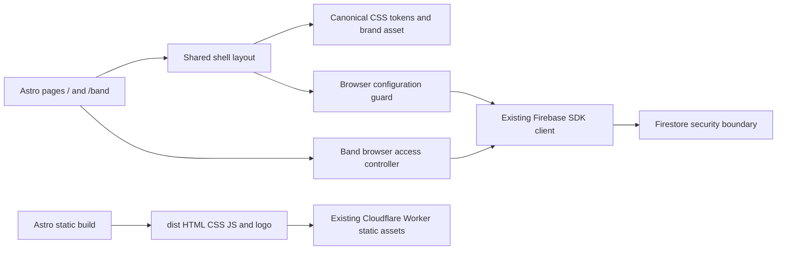

# Building Block View

## Availability workspace

The browser access entry mounts [availability-view.ts](../../src/band/availability-view.ts) only for an admitted UID and disposes its listeners and DOM on loss of admission. [availability.ts](../../src/band/availability.ts) owns civil-date/interval transformations independently of Firebase and DOM. The view composes native labelled forms, dynamic active-roster listeners and a read-only band overview. Persistence ownership is documented in [08](08-crosscutting-concepts.md).

[opportunities.ts](../../src/band/opportunities.ts) sweeps effective interval boundaries as a pure calculation; [opportunities-view.ts](../../src/band/opportunities-view.ts) presents its distinct outputs. The workspace supplies only fully loaded, server-confirmed active-roster data and disposes calculation presentation with the rest of the private view. No scheduling data is published publicly or persisted merely by inspecting calculated windows.

## Whitebox Overall System

The admitted browser entry also composes [repertoire-view.ts](../../src/band/repertoire-view.ts), separating pure metadata/link validation from [transactional persistence](../../src/band/repertoire-store.ts). Repertoire collection reads never enter public pages. The safe public projection and consistency boundary are owned by [section 08](08-crosscutting-concepts.md) and justified by [ADR-0002](../adr/0002-store-shared-songs-with-safe-public-projections.md).

| Building block | Responsibility | Source |
| --- | --- | --- |
| Public/member entry pages | Static public markup; /band starts the browser access flow | [pages](../../src/pages/) |
| Band access controller/adapter | Identity observation, membership listener and safe dashboard state | [access.ts](../../src/band/access.ts); [adapter](../../src/band/firebase-access.ts) |
| Shared layout/styles | Navigation, skip link, token-based responsive presentation | [Shell.astro](../../src/layouts/Shell.astro); [shell.css](../../src/styles/shell.css) |
| Browser guard | Avoid SDK startup in server evaluation or with incomplete explicit configuration | [browser.ts](../../src/firebase/browser.ts); [public configuration](../../src/firebase/configuration.ts) |
| Firebase boundary | Singleton Auth/Firestore and DEV-only emulator connections | [client.ts](../../src/firebase/client.ts) |
| Data security | Google identity, active membership and ownership enforcement; see [08](08-crosscutting-concepts.md) | [rules](../../src/firebase/firestore.rules) |
| Delivery support | ProductShape, toolkit, design/security checks, emulator and shell verification | [package.json](../../package.json); [lifecycle](../engineering-lifecycle.md) |

Astro configuration is executable source under src/. Root Wrangler JSON is declarative hosting metadata for native build discovery, not an application module. Output/dependency/cache directories are ignored. The overlap engine is a browser-local pure module; no UI framework or server API is introduced.

<!-- pdac:cite id="BR-MEMBERSHIP" digest="sha256:409b040a33d66b37f725e3cc707f503832341a2f52c3504ee3fea3c851a5cd45" -->

<!-- pdac:cite id="QR-SECURITY" digest="sha256:cc17a6ca5aa934716df56692e158d82384992152e4f3fdfd57bc1a83ff1ca9e9" -->

<!-- pdac:cite id="BR-OPPORTUNITY" digest="sha256:cc00716d47bbf9de4c555b4f9aa4fb723b5e0f35b20f1e7b5b76612760708cbc" -->

## Public content and member navigation

[src/public-site](../../src/public-site/) owns typed repository editorial content, guarded public links, Madrid upcoming-gig selection and anonymous reads of whitelisted public collections. Static Astro sections remain usable when data loading fails. Backstage navigation links to mounted feature sections without recreating editors or discarding drafts. Publication enforcement remains owned by [08](08-crosscutting-concepts.md).

<!-- pdac:cite id="FR-PUBLIC" digest="sha256:46aabeb5bd38ee43137c55e7fe8b7e108de20cd2b4d318c250de46c2494095c3" -->
