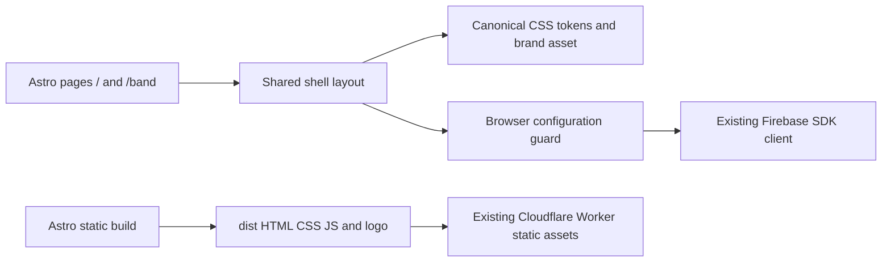

# Building Block View

## Whitebox Overall System

| Building block | Responsibility | Source |
| --- | --- | --- |
| Public/member shells | Non-sensitive entry surfaces; no business features | [pages](../../src/pages/) |
| Shared layout/styles | Navigation, skip link, token-based responsive presentation | [Shell.astro](../../src/layouts/Shell.astro); [shell.css](../../src/styles/shell.css) |
| Browser guard | Avoid eager SDK startup without valid public config or in server evaluation | [browser.ts](../../src/firebase/browser.ts) |
| Firebase boundary | Singleton Auth/Firestore and DEV-only emulator connections | [client.ts](../../src/firebase/client.ts) |
| Data security | Existing membership/ownership rules; not called by shells | [rules](../../src/firebase/firestore.rules) |
| Delivery support | ProductShape, toolkit, design/security checks, emulator and shell verification | [package.json](../../package.json); [lifecycle](../engineering-lifecycle.md) |

Astro configuration is executable source under src/. Root Wrangler JSON is declarative hosting metadata for native build discovery, not an application module. Output/dependency/cache directories are ignored. No UI framework, overlap engine or server API is introduced.
