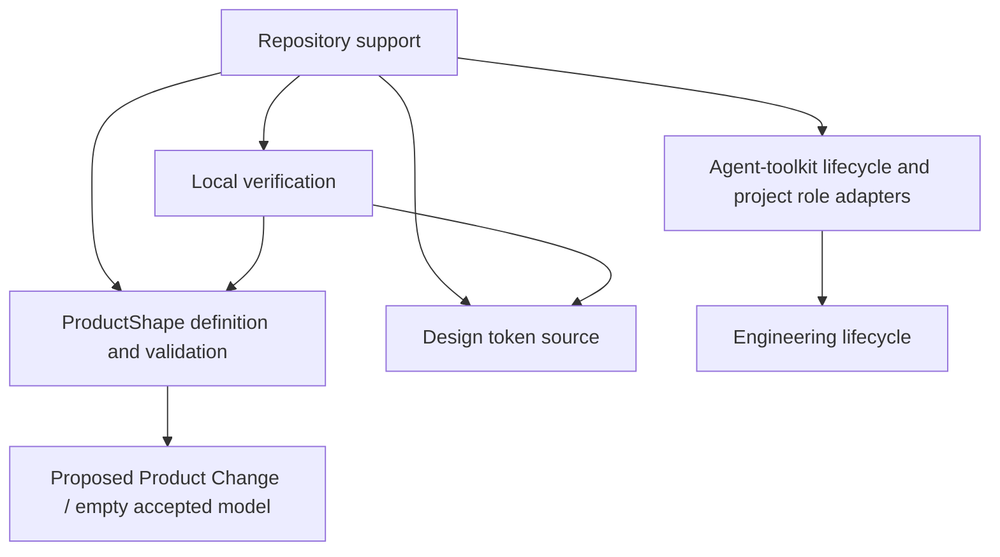

# Building Block View

## Whitebox Overall System

### Overview

The application UI and full internal decomposition remain unresolved. Existing support comprises repository tooling plus a framework-neutral Firebase client and data-security boundary. The diagram shows repository support; the Firebase boundary is listed in the contained blocks and explained in [08](08-crosscutting-concepts.md).

These are documentation/tooling responsibilities, not proposed application services or deployable modules.

### Decomposition Rationale

Repository ownership is governed by [AGENTS.md](../../AGENTS.md); application decomposition awaits the strategy in [04](04-solution-strategy.md). ProductShape's bounded context does not imply a code module or persistence aggregate.

### Contained Building Blocks

| Building block | Responsibility | Interfaces | Source location |
| --- | --- | --- | --- |
| Product definition tooling | Validate canonical and proposed intent; manage provider assets | Markdown, configuration, CLI | [Product docs](../product/README.md); [.product/config.yaml](../../.product/config.yaml) |
| Delivery support | Apply the adopted gates and GitHub/plan contracts | Lifecycle skills and project-owned role skills | [Lifecycle](../engineering-lifecycle.md); [APM manifest](../../apm.yml) |
| Design foundation | Supply the single token-value source | CSS custom properties | [tokens.css](../../src/styles/tokens.css); [design token model](../design/tokens.md) |
| Design verification | Enforce visual literals policy and verify rule/token behaviour | pnpm scripts and test runner | [Design tooling](../../src/tooling/design/check-design.mjs); [test suite](../../src/tests/design/) |
| Firebase client boundary | Initialize one SDK app, Auth and Firestore clients; opt into development emulators | Public build configuration and Firebase SDK exports | [client.ts](../../src/firebase/client.ts) |
| Firestore security boundary | Enforce current identity/membership and ownership checks | Firestore document operations and rules | [firestore.rules](../../src/firebase/firestore.rules); [rule tests](../../src/tests/firebase/firestore.rules.test.mjs) |

### Important Interfaces

[package.json](../../package.json) composes verification across design, type checks and ProductShape, and supplies emulator testing. Design tests consume the token source. The SDK boundary exports auth/db handles; rules operate on membership, availability, rehearsal and setlist documents. That provisional data structure is implementation evidence, not an accepted product model or a complete application API. No overlap engine or application UI exists yet.
