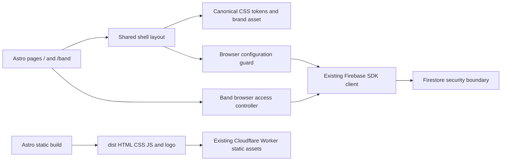

# Building Block View

## Whitebox Overall System

| Building block | Responsibility | Source |
| --- | --- | --- |
| Public/member entry pages | Static public markup; /band starts the browser access flow | [pages](../../src/pages/) |
| Band access controller/adapter | Identity observation, membership listener and safe dashboard state | [access.ts](../../src/band/access.ts); [adapter](../../src/band/firebase-access.ts) |
| Shared layout/styles | Navigation, skip link, token-based responsive presentation | [Shell.astro](../../src/layouts/Shell.astro); [shell.css](../../src/styles/shell.css) |
| Browser guard | Avoid SDK startup in server evaluation or with incomplete explicit configuration | [browser.ts](../../src/firebase/browser.ts); [public configuration](../../src/firebase/configuration.ts) |
| Firebase boundary | Singleton Auth/Firestore and DEV-only emulator connections | [client.ts](../../src/firebase/client.ts) |
| Data security | Google identity, active membership and ownership enforcement; see [08](08-crosscutting-concepts.md) | [rules](../../src/firebase/firestore.rules) |
| Delivery support | ProductShape, toolkit, design/security checks, emulator and shell verification | [package.json](../../package.json); [lifecycle](../engineering-lifecycle.md) |

Astro configuration is executable source under src/. Root Wrangler JSON is declarative hosting metadata for native build discovery, not an application module. Output/dependency/cache directories are ignored. No UI framework, overlap engine or server API is introduced.

<!-- pdac:cite id="BR-MEMBERSHIP" digest="sha256:409b040a33d66b37f725e3cc707f503832341a2f52c3504ee3fea3c851a5cd45" -->

<!-- pdac:cite id="QR-SECURITY" digest="sha256:cc17a6ca5aa934716df56692e158d82384992152e4f3fdfd57bc1a83ff1ca9e9" -->
