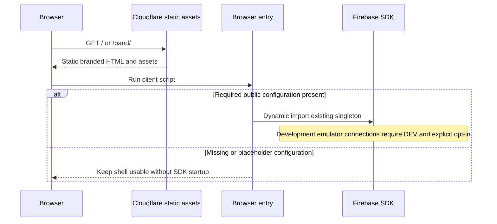

# Runtime View

## Shell request and browser startup

Build evaluation never imports the eager SDK client. Initialization failure reports a diagnostic code while the static shell remains usable. No sign-in, membership lookup, private read or write occurs in this slice. Production cannot activate development emulators.

## Verification

[Package scripts](../../package.json) compose source/design/security checks, production build, HTTP route/asset tests, ProductShape validation and Firestore emulator tests. Runtime verification drives both shells in a browser at mobile/desktop sizes, tests keyboard skip navigation and records page errors/private requests. Evidence is recorded in the [GH-1 delivery plan](../delivery/plans/GH-1.md).
