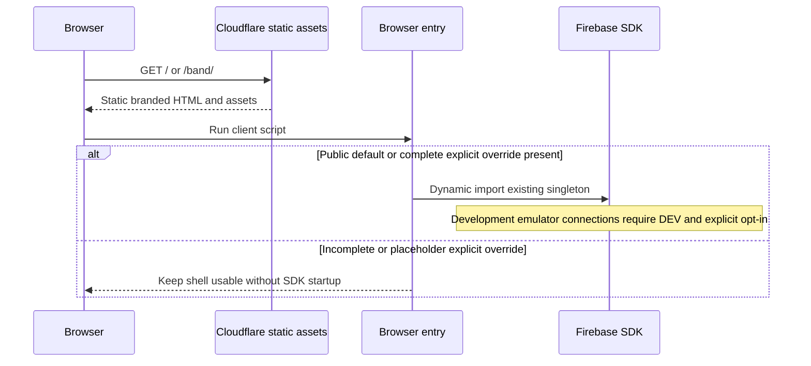

# Runtime View

## Shell request and browser startup

Build evaluation never imports the eager SDK client. Initialization failure keeps the static shell usable and denies private access. Production cannot activate development emulators. Development emulators additionally require a demo project identifier.

## Member access and revocation

The `/band` browser entry starts the access controller from [05](05-building-block-view.md). Firebase Auth resolves the identity and provider; the controller clears any previous member view before checking that identity's membership document. A live Firestore listener admits the member only after a server-confirmed active record. Cached records do not grant access. The data-boundary mechanism is owned by [08](08-crosscutting-concepts.md).

Identity changes invalidate prior membership callbacks. Membership revocation, listener failure and sign-out immediately remove the recognised name and dashboard. Sign-out failure is an error, not a successful signed-out claim. The static HTML contains no member record or name. Google popup sign-in originates in an explicit button action; popup failures expose a safe retry state.

Page suspension clears the member DOM and stops its observers. Persisted browser restoration creates a fresh controller and rechecks membership; a cached page cannot retain an admitted identity indefinitely.

See the [GH-2 plan](../delivery/completed/GH-2.md), [controller tests](../../src/tests/web/access.test.mjs) and [demo-only runtime harness](../../src/tooling/web/verify-access-runtime.mjs). Live OAuth requires the real account holder and is reported separately from emulator evidence.

## Verification

[Package scripts](../../package.json) compose source/design/security checks, production build, HTTP route/asset tests, ProductShape validation and Firestore emulator tests. Runtime verification drives both shells in a browser at mobile/desktop sizes, tests keyboard skip navigation and records page errors/private requests. Evidence is recorded in the [GH-1 delivery plan](../delivery/completed/GH-1.md).

<!-- pdac:cite id="BR-MEMBERSHIP" digest="sha256:409b040a33d66b37f725e3cc707f503832341a2f52c3504ee3fea3c851a5cd45" -->

<!-- pdac:cite id="QR-SECURITY" digest="sha256:cc17a6ca5aa934716df56692e158d82384992152e4f3fdfd57bc1a83ff1ca9e9" -->
