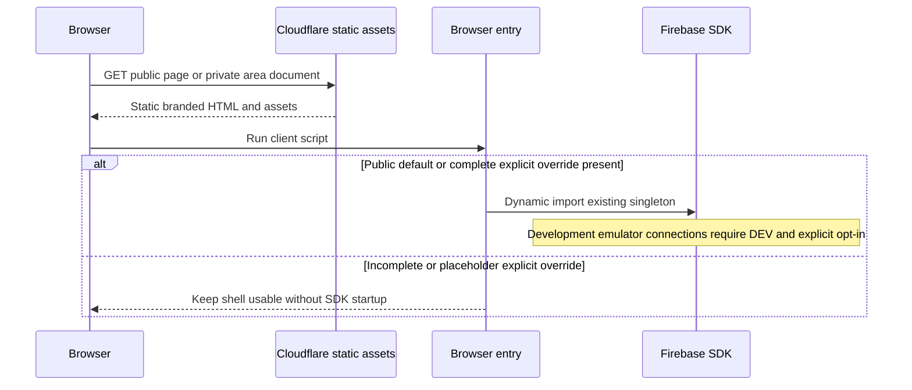

# Runtime View

## Shell request and browser startup

Build evaluation never imports the eager SDK client. Initialization failure keeps the static shell usable and denies private access. Production cannot activate development emulators. Development emulators additionally require a demo project identifier.

## Member access and revocation

The `/band` browser entry starts the access controller from [05](05-building-block-view.md). Firebase Auth resolves the identity and provider; the controller clears any previous member view before checking that identity's membership document. A live Firestore listener admits the member only after a server-confirmed active record. Cached records do not grant access. The data-boundary mechanism is owned by [08](08-crosscutting-concepts.md).

Identity changes invalidate prior membership callbacks. Membership revocation, listener failure and sign-out immediately remove the recognised name and dashboard. Sign-out failure is an error, not a successful signed-out claim. The static HTML contains no member record or name. Google popup sign-in originates in an explicit button action; popup failures expose a safe retry state.

The public Backstage · Entrar utility opens the member-only access shell, which explains that authentication creates no membership. Navigation itself does not open OAuth; the deliberate Google button does. A restored active session enters after server-confirmed membership without another popup. The explanatory prompt is removed on admission; checking, denied/error and signed-out shells contain no secondary member navigation. GH-29 changes presentation, not identity/provisioning/data authorization.

Page suspension clears the member DOM and stops its observers. Persisted browser restoration creates a fresh controller and rechecks membership; a cached page cannot retain an admitted identity indefinitely.

The admitted home waits for server-confirmed rehearsal/song/gig/setlist snapshots before composing current context. Read failure clears summaries; its minute timer retains existing time selection. Scheduling uses the shared guarded availability observer and pure summary, without hidden editors. Each page disposes its selected area's observers/timers/DOM on identity loss, failure, suspension or revocation.

Native secondary links load the destination static document and repeat the same membership decision before mounting its one area/current indicator. Home onward actions use actual area paths; a guarded async preparation target opens its existing disclosure and receives focus/scroll after creation. Header and wrapped member-navigation measurement leave targets visible. Native history restoration rechecks admission; no cached private DOM grants access.

Editor dirty and pending-save attributes trigger the native beforeunload choice. Cancel keeps the document/draft; deliberate departure may discard it. Confirmed saves and explicitly accepted in-area reloads clear the corresponding attribute; failed/conflicting saves keep it. Identity loss clears private DOM independently of draft state. No private draft storage or reusable application dialog is introduced. [ADR-0003](../adr/0003-use-static-private-pages-with-native-draft-protection.md) records this document lifecycle tradeoff.

<!-- pdac:cite id="FR-NAVIGATION" digest="sha256:90a7bf2a42e9cb61493b32b073abc81808c63958725f0ae29def2cdeaa297dc6" -->

See the [GH-2 plan](../delivery/completed/GH-2.md), [controller tests](../../src/tests/web/access.test.mjs) and [demo-only runtime harness](../../src/tooling/web/verify-access-runtime.mjs). Live OAuth requires the real account holder and is reported separately from emulator evidence.

## Verification

[Package scripts](../../package.json) compose source/design/security checks, production build, HTTP route/asset tests, ProductShape validation and Firestore emulator tests. Runtime verification drives both shells in a browser at mobile/desktop sizes, tests keyboard skip navigation and records page errors/private requests. Evidence is recorded in the [GH-1 delivery plan](../delivery/completed/GH-1.md).

<!-- pdac:cite id="BR-MEMBERSHIP" digest="sha256:409b040a33d66b37f725e3cc707f503832341a2f52c3504ee3fea3c851a5cd45" -->

<!-- pdac:cite id="QR-SECURITY" digest="sha256:cc17a6ca5aa934716df56692e158d82384992152e4f3fdfd57bc1a83ff1ca9e9" -->

## Public discovery and complete MVP verification

Astro emits the editorial sections and approved contact/media configuration at build time. The browser independently fetches publicSongs and publicGigs once per page visit, renders text safely, filters upcoming gigs in Madrid time and reports empty/unavailable states. No anonymous private read or Auth request is needed. The compact navigation responds to keyboard, Escape, link activation and viewport changes. Public navigation measures the fixed header and content, selects the viewport reading section, and updates aria-current plus the current URL hash without adding scroll history entries. Native fragment links retain query context and create navigation history; visible explicit entry/history destinations are retained until manual scrolling resumes geometry selection. Page restoration and resize reconcile the same state. The member sequence above includes GH-29 entry presentation and GH-30 separate-page lifecycle.

Approved editorial member presentation is also static. An empty profile collection emits an honest absence state. Public event dates use semantic time elements with Madrid civil-date formatting, while repertoire media links remain guarded external navigation. No private member listener is added to discovery. The built-shell guard permits only exact matching approved card fields and retains identity denial outside that deliberate surface; private collection/auth references remain forbidden even inside approved fields.

[Public runtime harness](../../src/tooling/web/verify-public-runtime.mjs) observes discovery and actual private-read denial using demo fixtures. GH-9 reruns the predecessor access, availability, opportunities, confirmation, repertoire, preparation and setlist browser suites against the current source; evidence distinguishes synthetic local journeys from anonymous deployed observations.

<!-- pdac:cite id="FR-PUBLIC" digest="sha256:5c70258017dd04a564f3a07ee727c1507b93efc0ea6c80f40617948aef48839b" -->

<!-- pdac:cite id="FR-NAVIGATION" digest="sha256:90a7bf2a42e9cb61493b32b073abc81808c63958725f0ae29def2cdeaa297dc6" -->
